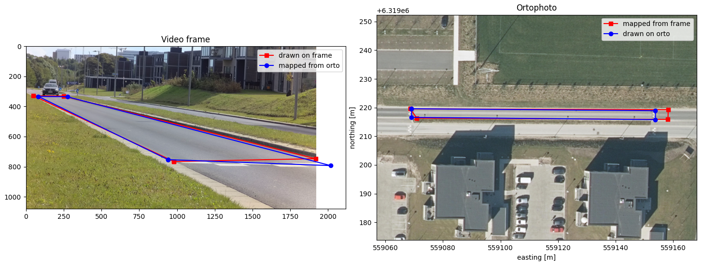

# Camera calibration
This subfolder contains examples connected to camera callibration topic, for example stimation of intrinsic and extrinsic camera parameters, calculation of transformation between views, camera allignment, converting pixel coordinates to world coordinates and more.

## `pixels_to_utm.py` 

Conversion between known pixel and UTM coordinates using `cv2.findHomography`.

### Dependencies
- cv2
- matplotlib
- numpy